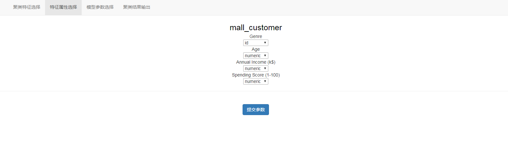
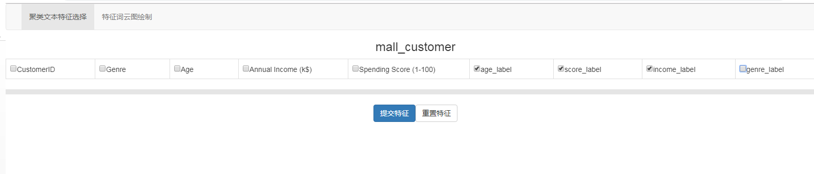

# Django_Kmeans
Kmeans的Django版本，将特征聚类的过程做成可以手动选择的界面。

融合的核心组件为kmeans, 后端开发使用Django。

依赖环境安装请使用
```
pip install -r requirements.txt
```

安装完成后在根目录下输入命令
```
python manage.py runserver
```
即可运行

运行界面演示：

1. 数据源表和字段的选择界面

<div align="center">  </div>

2. 字段属性的选择界面

<div align="center">  </div>

3. 模型参数的配置界面

<div align="center">  </div>

4. 聚类分析图表展示（手肘分析图， 变量分布图）

<div align="center">  </div>
<div align="center">  </div>

5. 文本特征分析所需特征手动选择

<div align="center">  </div>

6. 文本特征词云图展示
<div align="center">  </div>

